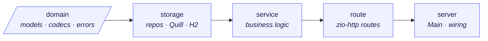
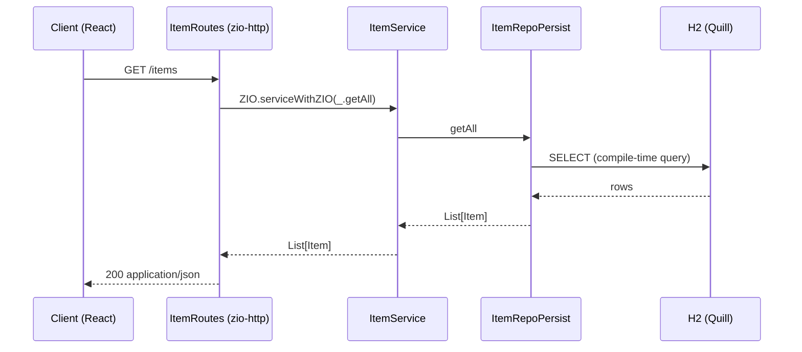

<div align="center">

# 🛒 ZIO Avito Desk

**A small, production-shaped classifieds board — built to showcase a modern, purely-functional Scala backend.**

[](https://www.scala-lang.org/)
[](https://zio.dev/)
[](https://github.com/zio/zio-http)
[](https://github.com/zio/zio-protoquill)
[](https://react.dev/)
[](#-testing)
[](#-license)

</div>

---

ZIO Avito Desk is a full-stack demo of a marketplace / classifieds board ("доска объявлений"). The
backend is a **layered, purely-functional ZIO 2 application on Scala 3**, and the frontend is a
**React 19 + TypeScript** single-page app. It's intentionally small in feature scope but built the way a
real service would be: clear module boundaries, dependency injection via `ZLayer`, a typed effect channel,
compile-time-checked SQL, and a test suite.

## 📸 Screenshots

|  |  |
|:--:|:--:|
| **Browse the board** | **Post a new ad** |
|  |  |
| **Item detail** | **Mobile** |
|  |  |

## ✨ Features

- 📋 **Browse** all listings in a responsive card grid
- 🔍 **Search** listings by name/description
- 🪟 **Item detail** in a polished modal
- ➕ **Create** a listing (with a category picker)
- 🗑️ **Delete** a listing (with confirm)
- 🏷️ **Categories** with seeded demo data on first run

## 🧰 Tech stack

| Layer | Technology | Version | Why |
|---|---|---|---|
| Language | **Scala 3** | 3.3.8 (LTS) | Modern syntax, `derives`, long-term support |
| Effects | **ZIO 2** | 2.1.26 | Typed, composable, testable concurrency |
| HTTP | **ZIO HTTP** | 3.11.2 | Declarative, type-safe routing on ZIO |
| JSON | **zio-json** | 0.9.1 | Fast, derivation-based codecs (`derives`) |
| Persistence | **Quill (ProtoQuill)** | 4.8.6 | Compile-time-checked SQL, ZIO-native |
| Database | **H2** | 2.4.240 | Zero-setup, file-backed for the demo |
| Testing | **zio-test** | 2.1.26 | First-class ZIO testing |
| Build | **sbt** | 1.12.5 | Multi-module build |
| Frontend | **React + TypeScript** | 19 / CRA | SPA with `fetch` + a dev proxy |

## 🏗️ Architecture

The backend is a **strict layered onion** — a multi-module sbt build whose dependencies point in **one
direction only**. This keeps the domain pure and the wiring explicit.



Each component is a `trait` + a `case class` implementation that exposes a `ZLayer` in its companion. All
layers are assembled **once**, in `Main`. Every effect is typed as `Task[A]` (error channel = `Throwable`).

### Request flow



### Modules

| Module | Responsibility |
|---|---|
| `domain` | Pure models (`Item`, `Category`) + `zio-json` codecs (`derives`) + errors. No effects. |
| `storage` | `ItemRepo`/`CategoryRepo` traits and Quill ProtoQuill implementations over H2. |
| `service` | `ItemService`/`CategoryService` business logic. |
| `route` | `zio-http` declarative `Routes` per resource, with inline request DTOs. |
| `server` | `Main` — composition root; provides the single shared `DataSource` and all layers. |

## 🚀 Getting started

### Prerequisites

- **JDK 17+**
- **sbt 1.12.x**
- **Node.js 18+** and npm

### Run the backend

```bash
sbt run        # starts the HTTP server on http://localhost:8080
```

On first run, H2 creates `userapp.mv.db` and seeds 3 categories + 5 items from
`server/src/main/resources/h2-schema.sql`.

### Run the frontend

```bash
cd frontend
npm install
npm start      # http://localhost:3000  (proxies /api calls to :8080)
```

> The frontend's `package.json` sets `"proxy": "http://localhost:8080"`, so relative `fetch('/items')`
> calls reach the backend in development.

## 🔌 API reference

| Method | Path | Description |
|---|---|---|
| `GET` | `/items` | List all items |
| `GET` | `/items/{id}` | Get an item by id (`404` if missing) |
| `GET` | `/items/search/{query}` | Search items by name/description |
| `GET` | `/items/category/{categoryId}` | Items in a category |
| `POST` | `/items` | Create an item |
| `DELETE` | `/items/{id}` | Delete an item |
| `GET` | `/categories` | List categories |
| `GET` | `/categories/{id}` | Get a category by id |
| `POST` / `PUT` / `DELETE` | `/categories` `/categories/{id}` | Manage categories |

### Examples

```bash
# List items
curl http://localhost:8080/items

# Create an item (categoryId must be an existing category)
curl -X POST http://localhost:8080/items \
  -H 'Content-Type: application/json' \
  -d '{"name":"Road Bike","description":"Lightweight aluminium frame",
       "price":499.00,"categoryId":"11111111-1111-1111-1111-111111111111","location":"Berlin"}'

# Search
curl http://localhost:8080/items/search/bike

# Delete
curl -X DELETE http://localhost:8080/items/<id>
```

## 🧪 Testing

```bash
sbt test        # runs the zio-test suites
```

The `service` module ships example `ZIOSpecDefault` specs (`ItemServiceSpec`, `CategoryServiceSpec`) that
run each service against a `Ref`-backed in-memory repository — fast, deterministic, no database required.
**10/10 tests pass.**

## 💡 Implementation highlights

- **Dependency injection with `ZLayer`** — components are wired declaratively; the data source is a single
  shared pool provided once in `Main`.
- **Compile-time SQL** — Quill ProtoQuill checks queries at compile time against the case-class schema.
- **Typed effects** — every operation is a `Task[A]`; route handlers map failures to HTTP responses
  centrally (`Server.serve(routes.handleError(...))`).
- **Strict compiler** — `-Wunused:all` + `-Xfatal-warnings` keep the code clean (unused imports fail the build).

## 📂 Project structure

```
zio-avito-desk/
├── domain/      # models, JSON codecs, errors
├── storage/     # repositories (Quill + H2)
├── service/     # business logic (+ tests)
├── route/       # zio-http routes
├── server/      # Main + application.conf + h2-schema.sql
├── frontend/    # React 19 + TypeScript SPA
└── docs/        # screenshots
```

## 📄 License

Released under the [MIT License](LICENSE). Free to use as a reference or starting point.
